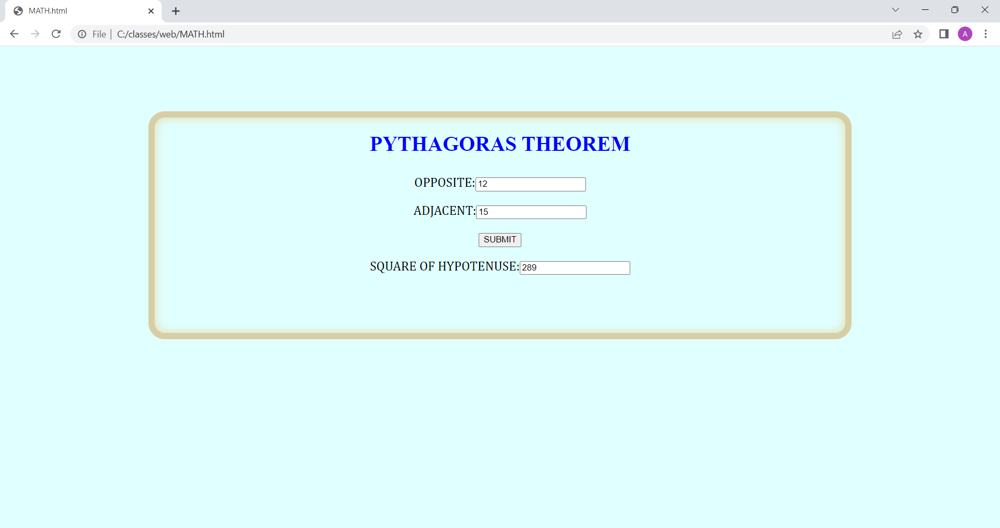

# Design a Website for Server Side Processing

# AIM:

To design a website to perform mathematical calculations in server side.

# DESIGN STEPS:

## Step 1:
Create a website using html.


## Step 2:
Create a code for frontend of calculation using HTML and CSS. 

## Step 3:
Then run the code.


# PROGRAM:

```
<!DOCTYPE html>
<html>
<head>
    <title></title>

</head>

<style>
    *{
        box-sizing: border-box;
        font-family: Arial, Helvetica, sans-serif;
        
    }

    body{ background-color: lightcyan;
    
    
    }

    .container{
    width: 1080px;
    height: 350px;
    margin-top: 100px;
    margin-left: auto;
    margin-right: auto;
    border-radius: 25px;
    border: 10px solid rgb(216, 206, 165);
    box-shadow: inset 0 0 15px rgb(231, 217, 160);
    
    }
    h1{

        color:blue;
        font-family:monotype corsiva;
        text-align: center;
    }
    .calculate{
        padding-top: 10px;
        padding-bottom: 10px;
        padding-left: 10px;
        padding-right:10px;
        text-align: center;
        font-size: 20px;
        padding-top: 7px;
        font-family: Cambria, Cochin, Georgia, Times, 'Times New Roman', serif;
        color:"red"
    }

</style>
<body>
    <div class="container">
        <h1>PYTHAGORAS THEOREM</h1>

        <form method="POST">

            <div class="calculate">
                OPPOSITE:<input type="number" name="OPPOSITE" value={{b}}></input><br/>
            </div>
            <div class="calculate">
                ADJACENT:<input type="number" name="ADJACENT" value={{a}}></input><br/>
            </div>
            <div class="calculate">
                <input type="submit" value="SUBMIT"></input><br/>
            </div>
            <div class="calculate">
                SQUARE OF 
                HYPOTENUSE:<input type="number" name="hypotenuse" value={{c}}></input>
            </div>
        </form>
    </div>
</body>
</html>

```


# OUTPUT:



# RESULT:

The program is executed succesfully
